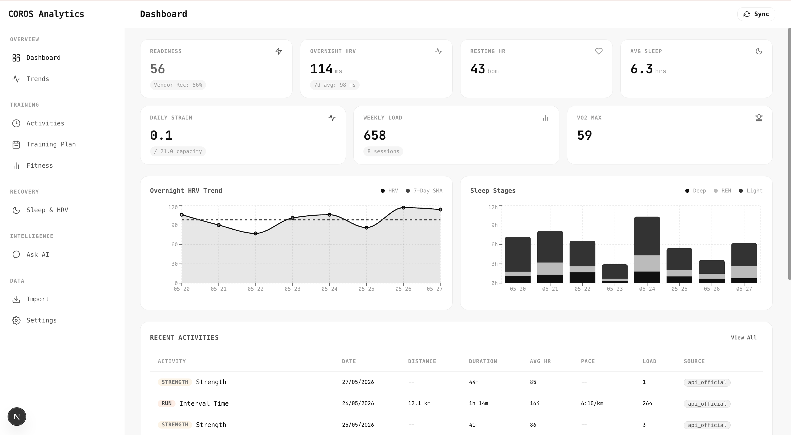

# COROS Analytics

> Self-hosted personal health and athletic performance analytics for COROS smartwatch users.

COROS Analytics ingests data from your COROS watch via the official API and manual file imports (FIT/TCX/ZIP), computes advanced training metrics, and provides a Gemini-powered AI coach for natural-language training analysis — all running on your own infrastructure with PostgreSQL and Redis.

<p align="center">
  
</p>

---

<p align="center">
  
  
  
  
  
  
  
</p>

---

## Features

### Data Ingestion
- **COROS API Sync** — Real-time data pull via authenticated COROS team and mobile APIs (AES-encrypted)
- **FIT/TCX/ZIP Import** — Drag-and-drop upload of raw activity files from COROS Training Hub exports
- **SHA-256 deduplication** — Every record is hash-checked to prevent double-imports
- **SSE progress streaming** — Live sync progress with stage-by-stage updates

### Analytics & Metrics
| Category | Computed Metrics |
|---|---|
| Training Load | ACWR (Acute:Chronic Workload Ratio), Monotony, Strain, Ramp Rate |
| Efficiency | Efficiency Factor, Cardiac Drift, HR Zone Distribution |
| Recovery | Readiness Score, Recovery Score, HRV 7/30-day SMA, HRV Z-scores |
| Fitness | VO2max trend, Running Fitness Index, Lactate Threshold, Biological Age |
| Performance | Race Time Prediction (5K/10K/Half/Marathon), Pace Zones (Daniels & Friel) |
| Anomaly | Z-score and IQR outlier detection on HRV, RHR, and training load |

### AI Coach (Gemini)
- **Chat** — Ask natural-language questions about your training data ("Am I overtraining?", "How should I taper for my race?")
- **Weekly Briefing** — Auto-generated summary of last week's training load, recovery, and progress toward goals
- **Workout Postmortem** — Per-activity AI analysis with context from recent training and recovery data

### Dashboard & Visualization
- Readiness, HRV, RHR, Sleep, Strain, and Training Load summary cards
- HRV trends with 7-day SMA, Sleep stage breakdowns, Recovery trend charts
- ACWR danger zone detection with Sweet Spot / Overreaching / Danger Zone indicators
- 6-week and 6-month trend charts (Recharts)
- Personal Records trophy cabinet

### Training Plan Integration
- iCal feed ingestion from published calendar (iCloud)
- Auto-classification of events (Run, Strength, Swim, Yoga, Pilates, Race)
- Today's plan, upcoming and past event timeline with configurable date windows

---

## Architecture

```
┌──────────────────────────────────────────────────────────────┐
│                        Next.js 16 SPA                         │
│  Dashboard  Activities  Trends  Sleep  Fitness  Plan  AI      │
│                     Recharts  React-Markdown                   │
└─────────────────────────────┬────────────────────────────────┘
                              │ HTTP / SSE
┌─────────────────────────────▼────────────────────────────────┐
│                     FastAPI (Python 3.12)                      │
│  /api/dashboard  /api/activities  /api/ai  /api/sync          │
│  /api/import     /api/settings    /api/training-plan          │
└───────┬──────────────────────┬───────────────────────────────┘
        │                      │
┌───────▼──────┐   ┌───────────▼──────────┐
│  PostgreSQL  │   │    COROS API Client   │
│   (asyncpg)  │   │  (team + mobile API)  │
└──────────────┘   └──────────────────────┘
        │
┌───────▼──────┐
│  Redis       │
│  (token      │
│   cache)     │
└──────────────┘
```

**Data provenance** is tracked on every record — vendor-provided metrics (`*_vendor` fields) are never overwritten by app-derived computations (`*_app` fields). Every record carries `source_type`, `source_hash`, and `parser_version`.

---

## Tech Stack

| Layer | Technology | Purpose |
|---|---|---|
| Frontend | Next.js 16, React 19, TypeScript 5 | SPA with App Router |
| Charts | Recharts 3.8 | Area, Bar, Line charts |
| Backend | FastAPI 0.115+, Python 3.12+ | REST + SSE API |
| ORM | SQLAlchemy 2.0 (async) + asyncpg | PostgreSQL access |
| Migrations | Alembic | Schema versioning |
| Job Queue | ARQ (Redis-backed) | Background parsing |
| Cache | Redis 7 | COROS API token cache |
| Parsing | fitdecode, lxml | .FIT binary and .TCX XML parsing |
| AI | google-genai (Gemini) | AI coach, briefing, postmortem |
| Encryption | PyCryptodome | COROS mobile API AES encryption |
| Logging | structlog | Structured KV logging |
| Lint/Type | ruff, mypy (strict) | Code quality |

---

## Quick Start

### Prerequisites

- Python 3.12+
- Node.js 20+
- Docker & Docker Compose

### 1. Clone and set up infrastructure

```bash
git clone https://github.com/<your-org>/coros-analytics.git
cd coros-analytics

# Start PostgreSQL and Redis
docker compose up -d
```

### 2. Configure environment

```bash
cp .env.example .env
# Edit .env with your COROS credentials and Gemini API key
```

### 3. Backend

```bash
cd backend
python -m venv .venv
source .venv/bin/activate
pip install -e ".[dev]"

# Run migrations
alembic upgrade head

# Start API server (http://localhost:8000)
uvicorn src.main:app --reload
```

### 4. Frontend

```bash
cd frontend
npm install
npm run dev
# Opens at http://localhost:3000
```

### 5. Initial data sync

Click **Sync Now** in the sidebar, or call:

```bash
curl -X POST http://localhost:8000/api/sync/now
```

Track progress via the SSE stream or the UI progress indicator.

---

## Configuration

All settings are in `.env` (copy from `.env.example`):

| Variable | Required | Default | Description |
|---|---|---|---|
| `DATABASE_URL` | Yes | `postgresql+asyncpg://...` | PostgreSQL connection string |
| `REDIS_URL` | Yes | `redis://localhost:6379/0` | Redis connection |
| `COROS_EMAIL` | For sync | — | COROS account email |
| `COROS_PASSWORD` | For sync | — | COROS account password |
| `SYNC_INTERVAL_MINUTES` | No | `15` | Scheduled sync interval |
| `GEMINI_API_KEY` | For AI | — | Google Gemini API key |
| `GEMINI_ENABLED` | No | `false` | Enable AI features |
| `GEMINI_MODEL` | No | `gemini-2.5-flash` | Gemini model ID |
| `APP_SECRET_KEY` | Production | `change-me-in-production` | Secret key |
| `RAW_FILE_STORE_PATH` | No | `./data/raw_files` | Uploaded file storage |

---

## API Endpoints

| Method | Path | Description |
|---|---|---|
| `GET` | `/api/health` | Health check |
| `GET` | `/api/dashboard/summary?days=` | Readiness, HRV, RHR, sleep, strain, load cards |
| `GET` | `/api/dashboard/training-load?days=` | ACWR, daily load series |
| `GET` | `/api/dashboard/fitness-trend?days=` | VO2max, fitness estimates trend |
| `GET` | `/api/dashboard/personal-records` | PR trophy cabinet |
| `GET` | `/api/activities/?sport=&limit=&offset=` | Activity list with filter/pagination |
| `GET` | `/api/activities/{id}` | Single activity detail |
| `GET` | `/api/activities/{id}/records` | Per-second time-series (HR, speed, power, elevation) |
| `POST` | `/api/ai/ask` | Chat with AI coach |
| `GET` | `/api/ai/briefing` | Weekly training briefing |
| `GET` | `/api/ai/postmortem/{activity_id}` | Workout postmortem |
| `POST` | `/api/import/upload` | Upload FIT/TCX/ZIP file |
| `GET` | `/api/import/jobs` | Import job history |
| `POST` | `/api/sync/now` | Trigger manual sync |
| `GET` | `/api/sync/stream?job_id=` | SSE progress stream |
| `GET` | `/api/sync/status` | Last sync status |
| `GET` | `/api/settings/profile` | Get/update user profile |
| `GET` | `/api/settings/goal` | Get/update training goal |
| `GET` | `/api/training-plan/events?days_back=&days_forward=` | iCal training plan |
| `GET` | `/api/training-plan/today` | Today's training events |

---

## Project Structure

```
coros/
├── .env.example              # Environment template
├── docker-compose.yml        # PostgreSQL + Redis
├── backend/
│   ├── pyproject.toml        # Python deps & tool config
│   ├── migrations/           # Alembic migrations
│   └── src/
│       ├── main.py           # FastAPI entry point
│       ├── config.py         # Pydantic-settings
│       ├── db/
│       │   ├── engine.py     # Async SQLAlchemy session
│       │   └── models.py     # 10 ORM models (User, Activity, Health, Sleep, Fitness, etc.)
│       ├── api/routes/
│       │   ├── activity_routes.py
│       │   ├── ai_routes.py
│       │   ├── dashboard_routes.py
│       │   ├── import_routes.py
│       │   ├── settings_routes.py
│       │   ├── sync_routes.py
│       │   └── training_plan_routes.py
│       ├── sync/
│       │   ├── api_client.py    # COROS API auth + data fetching
│       │   └── sync_manager.py  # Orchestration, upsert, SSE events
│       ├── parsers/
│       │   ├── fit_parser.py    # .FIT binary decoder
│       │   └── tcx_parser.py    # .TCX XML parser
│       ├── metrics/
│       │   ├── derived.py       # ACWR, efficiency, HR zones, strain, biological age
│       │   ├── baselines.py     # Rolling baseline, SMA, z-score
│       │   └── anomaly.py       # Z-score and IQR anomaly detection
│       └── ai/
│           ├── gemini_client.py    # Gemini SDK wrapper
│           ├── context_builder.py  # Builds markdown context from DB
│           └── prompts.py          # System prompts (coach, briefing, postmortem)
├── frontend/
│   └── src/
│       ├── app/
│       │   ├── page.tsx              # Dashboard
│       │   ├── activities/           # Activity list + detail
│       │   ├── ai/page.tsx           # AI chat
│       │   ├── fitness/page.tsx      # VO2max, race predictor, pace zones
│       │   ├── import/page.tsx       # Drag-and-drop upload
│       │   ├── plan/page.tsx         # iCal training plan
│       │   ├── settings/page.tsx     # Profile, goal, sync/AI config
│       │   ├── sleep/page.tsx        # HRV, sleep stages, recovery
│       │   └── trends/page.tsx       # ACWR, training load chart
│       ├── components/
│       │   ├── Sidebar.tsx           # 5-section navigation
│       │   └── SyncButton.tsx        # Sync trigger with SSE progress
│       └── lib/
│           ├── api.ts                # fetch + SSE helper
│           └── types.ts              # TypeScript interfaces
└── scratch/                      # Development scratchpad
```

---

## Roadmap

- [ ] Multi-user authentication (currently single-user with hardcoded ID)
- [ ] Background async file parsing via ARQ job queue
- [ ] Data export (CSV, FIT) and full data deletion
- [ ] Scheduled auto-sync via cron/ARQ
- [ ] MCP (Model Context Protocol) server integration
- [ ] Dockerized backend + frontend for one-command deployment
- [ ] Mobile-responsive design

---

## License

MIT
